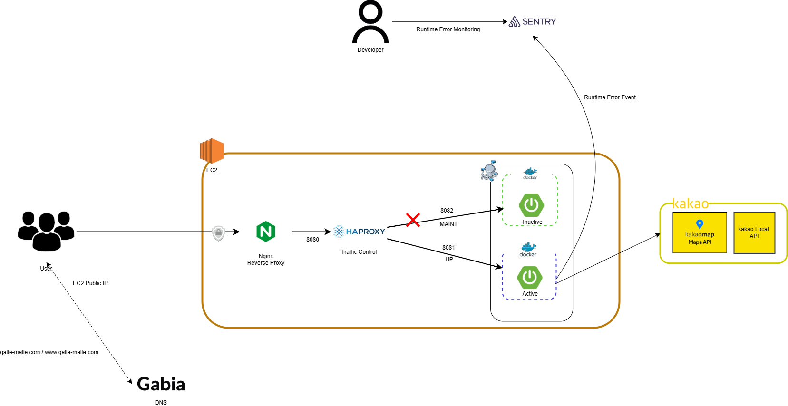

<h1 align="center">
  <a href="https://galle-malle.com">🗺️ 갈래말래</a>
</h1>

  <b>계획 없이 바로 뽑고 떠나는 국내 여행지역 랜덤 뽑기 서비스</b> 
  지금 바로 떠나보세요! 👉 <a href="https://galle-malle.com">galle-malle.com</a>

---

## 📖 Description
- 오프라인에서 지도 위에 무작위로 점을 찍어 여행지를 정하던 경험을 온라인 서비스로 구현했습니다.
- 목적지를 정하는 데 드는 고민을 줄이고, 버튼 한 번으로 국내 여행지를 랜덤으로 추천합니다.
- 계획보다는 즉흥적인 여행을 즐기는 사용자에게 적합한 서비스입니다.

---

## ✨ Main Feature
- 랜덤 국내 여행 지역 추천
   - 버튼 클릭 한 번으로 국내 여행지를 무작위로 추천합니다.
  - 행정구역 경계(GeoJSON) 내부 좌표만을 대상으로 합니다.
   - 선정된 지역의 지번 주소를 즉시 확인할 수 있습니다.
- 지도 기반 여행지 시각화 
   - 추천된 여행지를 지도 위에 마커로 표시합니다.
  - 행정구역 경계를 함께 시각화해 위치의 맥락을 제공합니다.
---
## 🛠 Tech Stack

###  Backend & Geo-Data Processing

  
  
  
  
  
  

* **JTS (Java Topology Suite)**: In-Memory 공간 연산을 통한 **Point-in-Polygon(행정구역 판별)** 로직 구현
* **GeoJSON**: 대한민국 행정구역 경계 데이터를 프로젝트 규격에 맞게 가공하여 공간 데이터 표준화
* **Sentry**: Spring Boot 애플리케이션의 런타임 예외 및 에러 이벤트를 실시간으로 수집·모니터링

### Frontend

  
  
  
  
  

### API

* **Kakao Local API**
  - 위경도 좌표를 기반으로 **지번 주소로 변환** 
* **Kakao Map API**
  - 지도 렌더링 및 **랜덤으로 선택된 위치 마커 표시**
  - GeoJSON 기반 행정구역 경계 데이터를 활용한 **폴리곤(다각형) 시각화**

### Infra

  
  
  
  
  

### CI/CD

  

- GitHub Actions 기반의 이미지 빌드 및 배포 자동화
---
## System Architecture

---
## Zero-Downtime Deployment (Blue-Green)

- Haproxy 기반의 Blue-Green 배포 전략을 적용하여,
배포 과정 중에도 서비스가 중단되지 않도록 구성했습니다.
- HAProxy Runtime Socket을 활용해 트래픽을 즉시 제어합니다.

### Blue → Green 전환 배포 흐름 (Sequence Diagram)

---
### 🔐 Security &  Monitoring
- GitHub Secrets 기반 Secret 관리
- 배포 시점 쉘 주입 방식으로 환경 변수 동적 할당
- Sentry 연동을 통한 실시간 에러 모니터링

---

## 🔥 Troubleshooting

### 1. 배포 중 다운타임 문제
- 초기에는 Nginx upstream 포트 변경 방식으로 트래픽을 전환했으나,
  설정 반영을 위한 Nginx reload 시점에 짧은 다운타임이 발생하는 것을 확인하였다.

- **해결**
  - HAProxy를 추가 도입하여 역할을 분리하였다.
  - Nginx는 SSL 종료 및 리버스 프록시를 담당하고
    HAProxy는 트래픽 제어를 전담하도록 구성하였다.
  - HAProxy Runtime API(Socket)를 이용해
    백엔드 서버의 상태를 실시간으로 변경(Weight 조절 / Drain 전환)함으로써
    Nginx reload 없이 **완전한 무중단 배포 환경**을 구축하였다.

---

### 2. EC2 인스턴스 메모리 부족
- RAM 1GB의 EC2 단일 서버 환경에서 무중단 배포 시
  Docker 컨테이너가 짧은 시간 동안 동시에 기동되며
  메모리 부족(OOM) 문제가 발생하였다.

- **해결**
  - Swap 메모리 사용은 성능 저하 가능성을 고려하여 최소화하고,
    JVM Heap Memory를 조정하여 메모리 부족 문제를 완화하였다.
  - 이를 통해 무중단 배포 과정에서도
    안정적인 서버 기동을 유지할 수 있도록 개선하였다.

---

### 3. 반복 API 호출 문제
- 대한민국을 포함하는 임의의 바운딩 박스 안에서
  랜덤 좌표를 생성하여 외부 API를 호출하는 과정에서
  바다 또는 국외 좌표로 인해
  정상적인 지번 주소를 반환하지 못하는 문제가 발생하였다.
- 초기에는 오류 발생 시 좌표를 재생성하여
  외부 API를 반복 호출하는 방식으로 대응했으나
  불필요한 외부 API 호출 증가와 운영 리스크가 존재하였다.

- **해결**
  - 대한민국을 포함하는 임의의 바운딩 박스를 기준으로
      랜덤 좌표를 생성한 뒤,
      대한민국 행정구역 GeoJSON 데이터를 활용하여
      JTS Point-in-Polygon 검증을 API 호출 이전 단계에 선행하였다.
  - 행정구역 폴리곤 내부에 포함된 좌표에 대해서만
    외부 API를 호출하도록 구조를 개선하여
    국내 육지 지역에 대한 결과만 응답하도록 보장했다.

  
